name: inverse
layout: true
class: center, middle, inverse
---

# Building Cross Platform Applications 
# in Python using BeeWare
### Bob Marchese

---
layout: false
## What is BeeWare?
------------
.left-column[
## The Pitch :

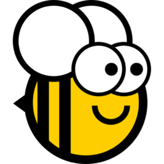
]
.right-column[

The BeeWare project is a collection of open source tools 

that enable a Python programmer to create and deploy 

applications for a variety of platforms. The goal is to make 

the development experience as easy as possible and to

include mobile platforms along with the traditional 

desktops.

- One codebase, multiple apps

- Uses Python native tools

- Targets mobile and desktop

- Applications behave natively

- Opens source, BSD liscensed

"Native widgets - not themes"

]

---

## The BeeWare Project
------------
Home Page https://pybee.org/

Founded by Dr. Russel Keith-Magee, one of the Django core developers

His talk at PyCon 2018 https://www.youtube.com/watch?v=qaPzlIJ57dk

Under active develpoment on GitHub with a core team of 8 people and nearly 100 contributers worldwide.

---

## Getting Started with BeeWare
------------
- As a Python native tool, the developer experience begins with pip

- Best practices suggest that you should use virtual environments

```dos
    D:\>mkvirtualenv beeware-env
    Using base prefix 'd:\\python36-32'
    New python executable in D:\Envs\beeware-env\Scripts\python.exe
    Installing setuptools, pip, wheel...done.

    (beeware-env) D:\>pip install beeware
    Collecting beeware
    ...
    (beeware-env) D:\>
```

---

## Create a New Project
------------
- BeeWare includes a script for starting a new project

    - Based on Cookiecutter, a general purpose tool for setting up projects

    - Uses a template from Briefcase

```dos
    D:\>beeware new
    Creating new BeeWare project using the Briefcase Template...
    app_name [appname]: demo
    formal_name [App Name]: Demo Application
    description [An app that ... ]: Show BeeWare's features
    author [Jane Developer]: Bob Marchese
    author_email [jane@example.com]: bobm123@gmail.com
    bundle [com.example]: com.bobmarchese
    Select license:
    1 - BSD license
    ...
    8 - Other
    Choose from 1, 2, 3, 4, 5, 6, 7, 8 [1]:
    Select gui_framework:
    1 - Toga
    2 - None
    Choose from 1, 2 [1]:
```

---
## What Briefcase Gives You
------------
- A project director with a stub application

```dos
demo/
    .gitignore
    LICENSE
    README.rst
    setup.py
    demo/
        app.py
        __init__.py
        __main__.py
        __pycache__/
```

- To run it, navigate to demo and run as a python module

```dos
(beeware-env) D:\>cd demo

(beeware-env) D:\demo>python -m demo
```

---

## The Starter App (WinForms version)
------------
A fully functional Windows application that doesn't do anything useful.
 
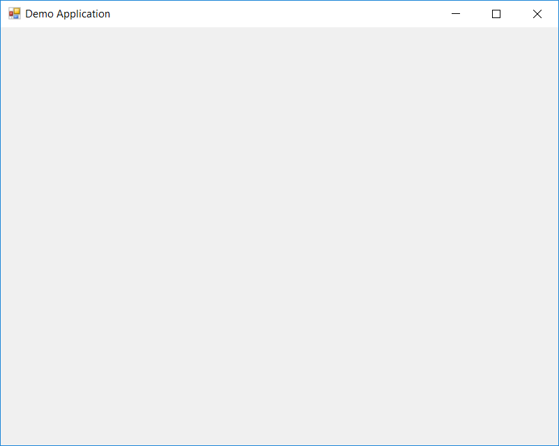

---

## The Starter App Code
------------
Code goes in `demo/demo/app.py`

```python
import toga
from toga.style import Pack
from toga.style.pack import COLUMN, ROW

class DemoApplication(toga.App):
    def startup(self):
        # Create a main window with a name matching the app
        self.main_window = toga.MainWindow(title=self.name)

        # Create a main content box
        main_box = toga.Box()

        # Add the content on the main window
        self.main_window.content = main_box

        # Show the main window
        self.main_window.show()


def main():
    return DemoApplication('Demo Application', 
                           'com.bobmarchese.demo')
```

---

## Deploy the Application with Briefcase
------------
.left-column[

]
.right-column[

This is where Briefcase component of the BeeWare project comes in. The setup.py BeeWare generated earlier includes info for building each target platform.

- Setup.py collects the dependencies and gets them ready for packaging
- Places them in the project folder under Windows, Linux, macos etc.
]

---

## Create a Windows Installer using WiX
------------
Briefcases uses the WiX toolset to create an installer for your application. This must be installed seperately and can be found here:

http://wixtoolset.org/
https://github.com/wixtoolset/wix3/releases/tag/wix3111rtm

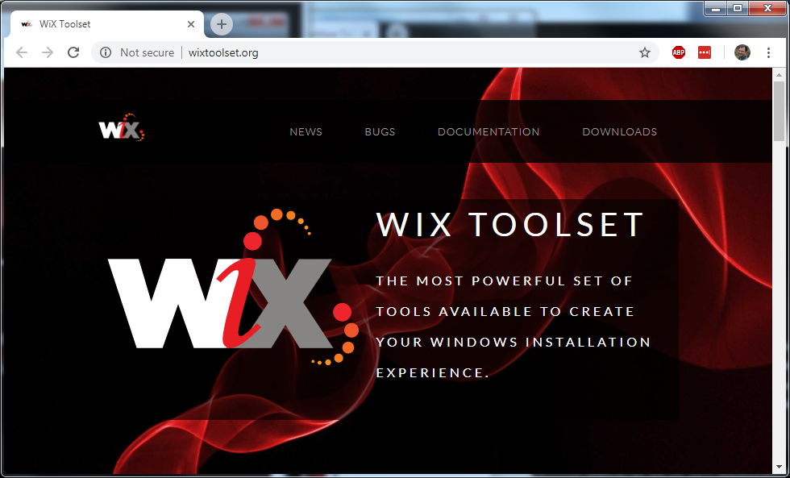 


---

## Create an Installer for your Application
------------

To create a windows installer, run setup.py from the project directory. This generates subdirectory that containing a .msi installer.

```dos
(beeware-env) D:\demo>python setup.py windows -s
```

This will also run the application, to compile the installer without running the app, leave off "-s"

```dos
(beeware-env) D:\demo>python setup.py windows
```

---

## Create an Installer for your Application
------------
Note: this may warn about Toga because BeeWare ships (as of 10/07/2018) with version 0.3.0.dev11, but the Briefcase templates use Dev9. To fix this, edit the 'options' sections of setup.py to point to the correct Toga version.

```python
        ...

        # Desktop/laptop deployments
        'macos': {
            'app_requires': [
                'toga-cocoa==0.3.0.dev11',
            ]
        },
        'linux': {
            'app_requires': [
                'toga-gtk==0.3.0.dev11',
            ]
        },
        'windows': {
            'app_requires': [
                'toga-winforms==0.3.0.dev11',
            ]
        },

        ...
```
 
---

## Using the Application Installer
------------
You can give this installer (.msi) file to a friend. They can install it, run it, and they never need to know it was written in Python!

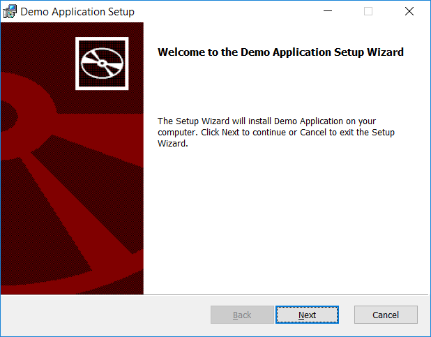

---
## Running the Installed Application
------------
After the application has been installed, it can be run from the familiar "Start" window

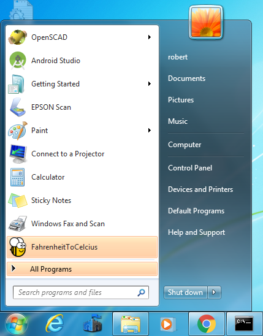

---

## Installing on Desktop Platforms - Linux
------------
```
python setup.py linux -s
```

This produces a Linux subdirectory containing a shell script that will start the application.

---

## Installing on Desktop Platforms - macOS
------------
```
python setup.py macos -s
```
This produces a macOS subdirectory containing an application bundle.

---

## Installing on Mobile Platforms - Android
------------
```
python setup.py android -s
```

This produces an android subdirectory that contains a Gradle project. It will also launch the app on the first Android device or simulator that can be found running on (or attached to) your computer.

To run, must also have a copy of Android studio installed. See this link for details:

https://briefcase.readthedocs.io/en/latest/background/getting-started.html#android

Unfortunately, current versions of Android Studio are not compatible with this project.

---
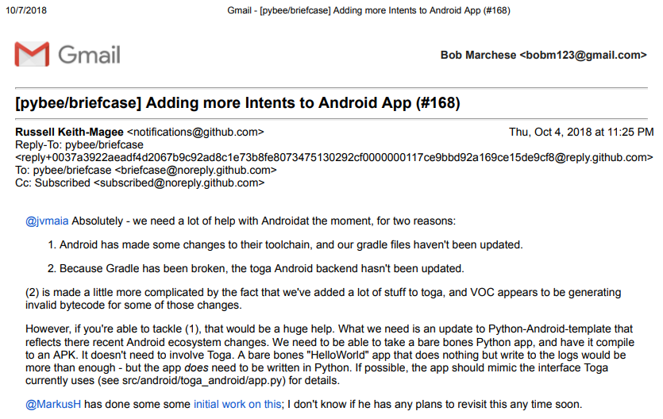
---

## Some Android Work in Progress
------------
A cookiecutter template and walkthrough using VOC without Toga (Pybee components)

https://github.com/MarkusH/Python-Android-template/tree/3.6-fixup-gradle

A demo app of Tic Tac Toe game also using Beeware components

https://github.com/eliasdorneles/tictactoe-voc

---

## Installing on Mobile Platforms - iOS
------------
```
python setup.py ios -s
```

This starts the iOS simulator (you may be asked to select an API and a simulator device on which to run the app) and run your app.

It will also produce an ios subdirectory that contains an XCode project called Hello World.xcodeproj. You can open this project in XCode to run your application.

---

## Running in the Browser
------------
The setup.py that Briefcase created handles installation of Django (a Python web framework) and its dependencies. As a webb app, it needs some additional Javascript code to run.

- Install an LTS version of Node (6.9.x)
- Install NPM 4.x or higher
- Available at https://nodejs.org/en/download/

You will also need to "pip install django" and another package "django-environ". Then you can run setup to create the django version of the app

```
python setup.py django -s
```

This collects all the Javascript dependencies, compiles the app and starts a Django webserver on localhost:8042, then launches a browser.

Generates a Django project that can be run again from manage.py

```
python manage.py
```

---

## More Information on Briefcase
------------

Instructions on setting up development environments for each platform can be found here:

https://briefcase.readthedocs.io/en/latest/background/getting-started.html

Some additional examples here:

https://briefcase.readthedocs.io/en/latest/tutorial/index.html

---

## A More Useful App
------------

Russell wrote an application called "Travel Tips". It shows costs in local and home currency, then calculates the amount for a tip. 

Clone the git repo and run the app for yourself!

https://github.com/freakboy3742/traveltips

---

## Travel Tips on Windows
------------

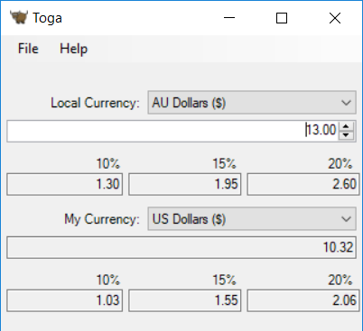

---

## The same application on Linux
------------

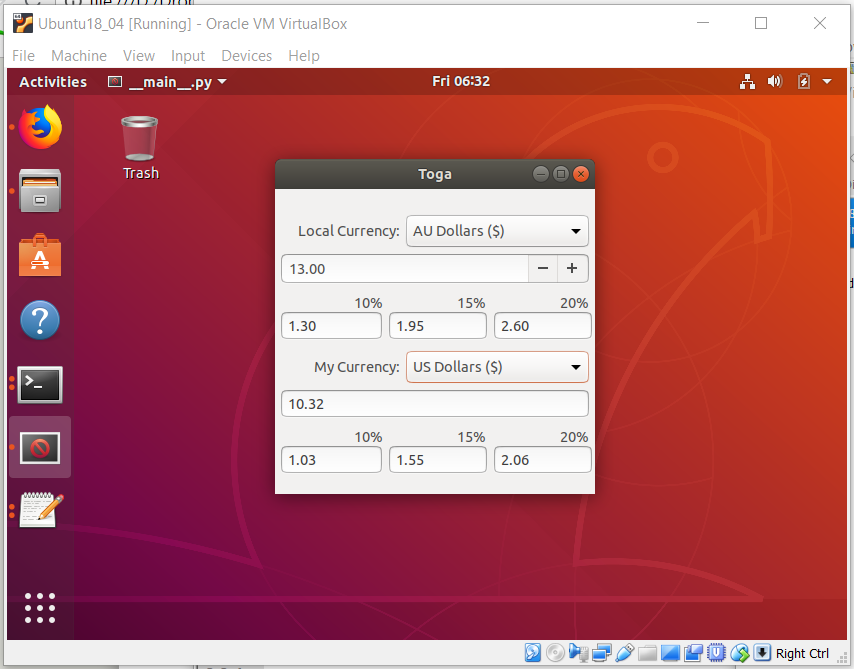

---

## Traveltips on Mac
------------


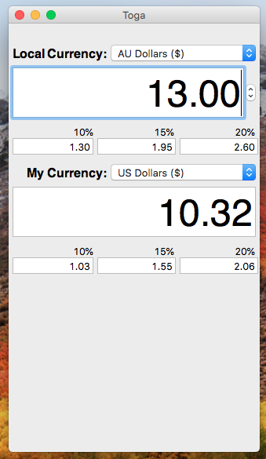

---

## Travel Tips in the Apple App Store
------------

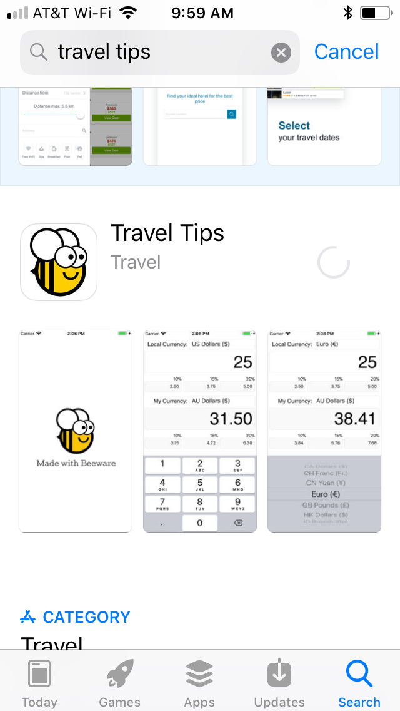

---

## Travel Tips on my iPhone screen
------------

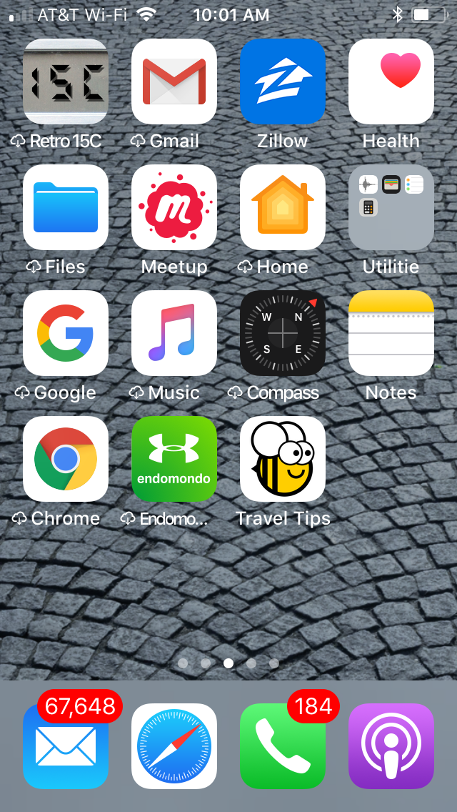

---

## Travel Tips running on my iPhone
------------

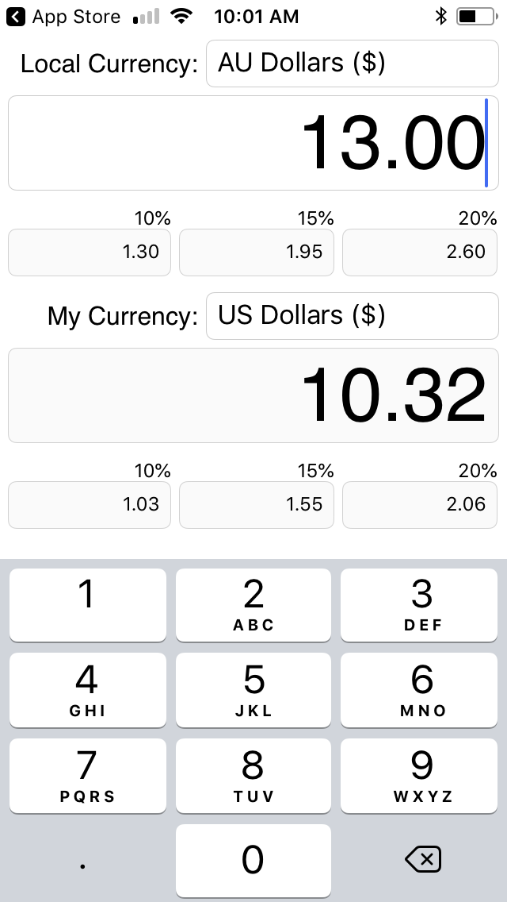

---

## How did it do that?
------------

Windows and Linux provide good Python bindings to their respective APIs.

But some systems do not. BeeWare provides 3 approaches for dealing with them. 

#### Rubicon 
- for Apple (iOS, macOS) that use Objective C

#### VOC
- A traspiler for Python to Java Byte code needed for Andoid

#### Batavia
- A Javascript implementation of the CPython virtual machine

- Could move to transpiler model with advent of WebAssembly (https://webassembly.org/)

---

## Rubicon for Apple Ecosystems
------------

.left-column[
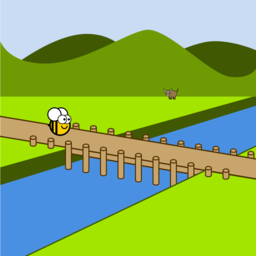
]
.right-column[

macOS and iOS native APIs are accessed from Objective C.

- Rubicon Provides a bridging library

- Objective C is a statically typed language

- Python is a dynamically typed language
    - Rubicon uses Python3 type annotations

Details on the Rubicon project page:

https://rubicon-objc.readthedocs.io
]

---

## VOC for Python to Java
------------

.left-column[

]
.right-column[
Android development usually happens in Java, so you can count on the Java Virtual Machine being present. VOC is a transpiler that produces Java bytecodes from Python.

- In theory, this could be done by translating Python bytecodes to Java bytecodes

- In practice, this is difficult because of compiler optimizations

- Another approach is to use the Abstract Syntax Tree (AST) objects generated by the Python compiler.

More info in Dr. Keith-Magee's talk at PyCon 2017

https://www.youtube.com/watch?v=9c4DEYIXYCM
]

---

## Python in the Browser
------------

.left-column[

]
.right-column[
JavaScript is the language of the Web.

Batavia uses it to implement a Python virtual machine.

- Executes python byte code in the Browser

- Lets Python code access objects and classes defined in JavaScript

See the project page on GitHub.org for more details

https://github.com/pybee/batavia
]

---

## Creating your own Application
------------

.left-column[
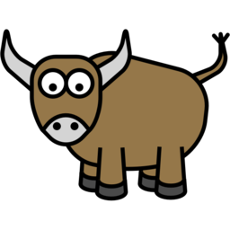
]
.right-column[


Let's make that Demo application a little more interesting with some Widgets
- Toga is the component that allows you create cross platform GUI apps

- Provides an abstraction layer between Python and the Native APIs
]

---

## Creating your own Application
------------

That starter app doesn't even say "Hello World!", let's change that!

```python
    def startup(self):
        # Create a main window with a name matching the app
        self.main_window = toga.MainWindow(title=self.name)

        # Create a main content box
        main_box = toga.Box()

        # Add something to the main box
        main_box.add(toga.Label('Hello World!'))

        # Add the content on the main window
        self.main_window.content = main_box

        # Show the main window
        self.main_window.show()
```

---

## Creating your own Application
------------

Now some static text appears in the main box

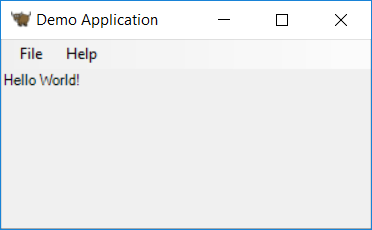

---

## Boxes inside boxes
------------

Toga uses something similar to the DOM model for window layout

Includes a module called Pack that can apply CSS3-like styles

- I think of Toga's boxes as an abstract widgit type where:

    - Boxes can nest inside of other boxes

    - Boxes can contain other widigts

    - Contents of boxes can stack by rows or columns

---

## Layout Example
------------

Put some nested content in the Demo application's main window

```python
        # Create another box and add it to main_box
        grid_box = toga.Box(style=Pack(direction=COLUMN,
                                       padding=5))
        main_box.add(grid_box)

        # Add 4 x 5 array of Buttons to the grid box
        count = 1
        for row in range(5):
            row_box = toga.Box(style=Pack(padding=5))
            for col in range(4):
                row_box.add(toga.Button(f'{count}',
                                        style=Pack(padding=5)))
                count += 1
            grid_box.add(row_box)

        # Add the content on the main window
        self.main_window.content = main_box
```

---

## Layout Example
------------

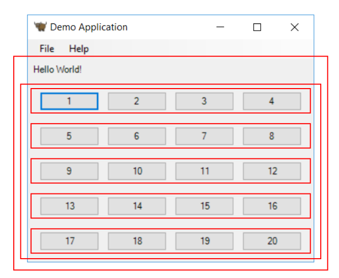

---

## Code Examples
------------

Toga includes several examples to get you started.

- Most focus on a specific widget

- Also has few simple applications

- Clone the Toga repository or view them on-line: https://github.com/pybee/toga/tree/master/examples

---

## Code Examples
------------
- beeliza - from Pycon 2018 walkthrough 
- button - Several Button styles
- canvas - Drawing on the canvas
- detailedlist - List view with related information
- dialogs - Modal dialog boxes
- imageview - Display an image given a URL
- multilinetextinput
- progressbar
- scrollcontainer
- selection - Dropdown style list selection
- slider - Set numeric values with up/down arrows
- switch - Radio button
- table
- table_source
- tree
- tree_source
- tutorial0 - Hello World!
- tutorial1 - Farenheit to Celsius
- tutorial2 - Combines scrolling windows and buttons
- tutorial3 - Webview example
- tutorial4 - Canvas and drawing primatives

---

## Running the Examples
------------

- Clone the git repository

    - Note, this installs another source copy of Toga.

    - It is a seperate copy of the library from the installed 
      with pip earlier. 

```dos
(beeware-env) D:\staging>git clone https://github.com/pybee/toga.git

(beeware-env) D:\staging>cd toga\examples\button

(beeware-env) D:\staging\toga\examples\button>python -m button
```

---

## Running the Examples - Buttons
------------

The Buttons Demo should appear

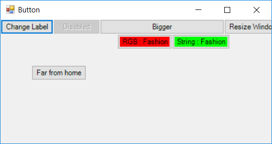

---

## Running the Examples - Switches
------------

Toggle Switch Widgets

```dos
(pybee) D:\demo\toga\examples>cd switch

(pybee) D:\demo\toga\examples\switch>python -m switch
```

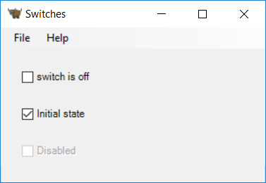

---

## Running the Examples - Dialogs
------------

Main window with several buttons that bring up various modal dialogs

- User defined dialogs 
- System dialogs (file open, save and folder select)

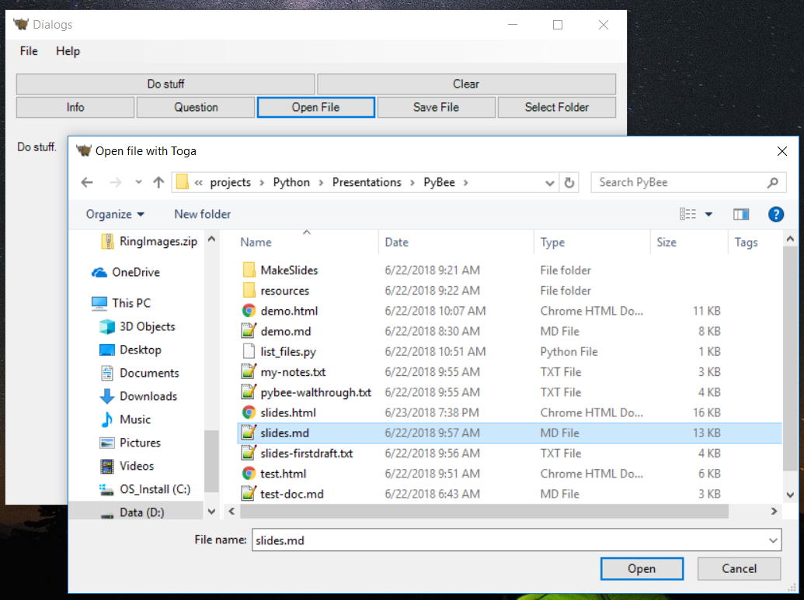

---


## The Bad News
------------

The BeeWare project is still in its infancy. It's not even version 0.3 yet.

- Some examples will not run on every platforms.

- Much work remains in Toga writing abstractions for the target APIs 
    - The Canvas widget still under development for Windows

- Windows integration with event loop is limited 
    - The yield instruction does on work from a widget handler function

 
```python
>>> import beeware
>>> beeware.__version__
'0.1.1'
>>>
```

---

## Expect Some Bugs
------------

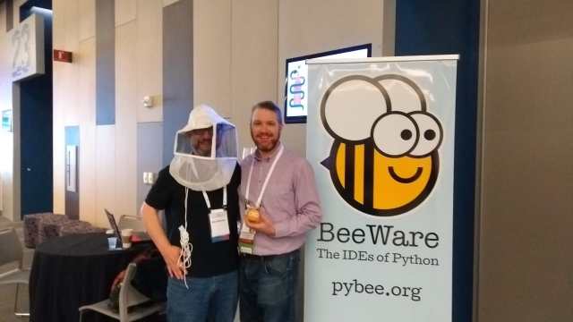

Hand and Eye Protection Recommended!

---

## You Can Help
------------

- They are activly seeking corporate sponsorship.

- If you've ever wanted to help with an open source project, BeeWare might be the place to start!

- The documentation includes detailed instructions for making your first code contribution.


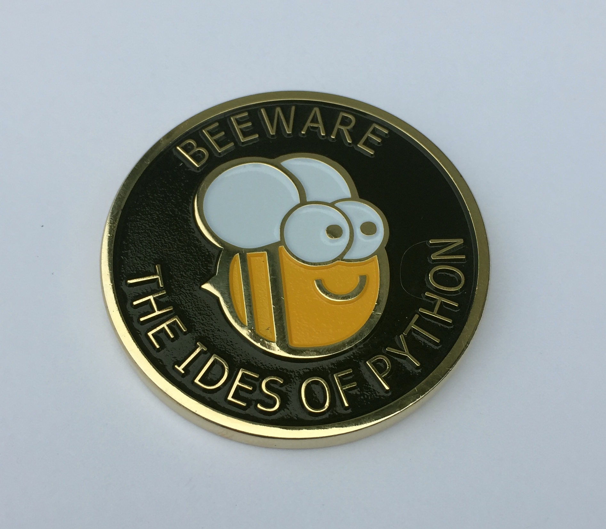

---

## For More Info
------------

### Project links

- The main project site: https://pybee.org/

- The project on GitHub: https://github.com/pybee

- Traveltips on GitHub: https://github.com/freakboy3742/traveltips

- The Briefcase Docs: https://briefcase.readthedocs.io/en/latest/

- The Toda Docs: https://toga.readthedocs.io/en/latest/

- My GitHub repository: https://github.com/bobm123

---

## For More Info
------------

### Videos

PyCon 2018 - RKM - The "Beeliza" code example

- https://www.youtube.com/watch?v=qaPzlIJ57dk

PyCon 2017 - RKM - Writing a Transpiler

- https://www.youtube.com/watch?v=9c4DEYIXYCM

WebAssembly and the Death of JavaScript

- https://www.youtube.com/watch?v=pBYqen3B2gc

---
name: centerlayout
layout: true
class: center, middle
---
template: centerlayout

# Credits


Graphics taken from the BeeWare project, https://pybee.org/

Special thanks to Dr. Russell Keith-Magee and the BeeWare 
team for making this project available.

---
template: inverse

# Thanks for watching!
### questions?
